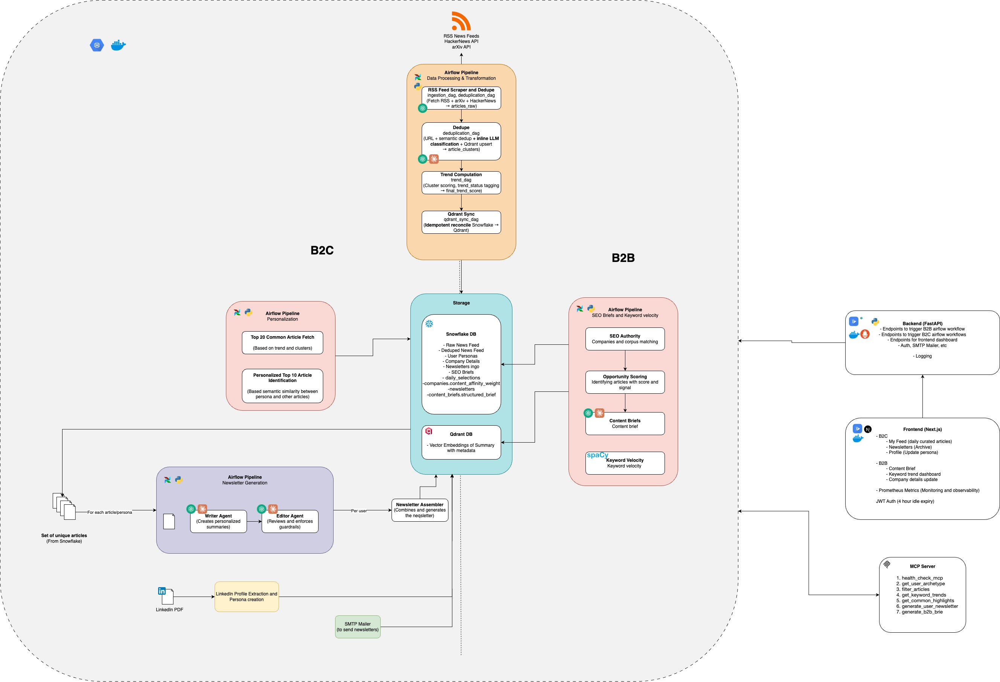

# CurateAI 🚀
> **Multi-Tenant AI News Intelligence Platform for Personalized Technical Content Delivery**


**CurateAI** is a multi-tenant AI news intelligence platform that ingests ~3,000 technical articles a day from RSS feeds, ArXiv, and HackerNews; deduplicates them into story clusters using a dual-layer URL + semantic pipeline; ranks them against each reader's persona; and publishes a daily newsletter for individual users plus a research brief for enterprise tenants. The B2C stack is driven by a 10-dim user-persona weight vector; the B2B stack introduces a symmetric company-affinity vector that injects hard category constraints into LLM prompts, producing briefs that are measurably more differentiated across tenants (cross-tenant cosine similarity dropped from 0.60 → 0.52). Both verticals are delivered through LangGraph agents, orchestrated by Apache Airflow, and surfaced via a Next.js 16 frontend.

---

## 🏛 Architecture Diagram



> Ingestion (RSS / ArXiv / HN) → dedup (URL + semantic) → cluster → trend-rank → two parallel LangGraph agents (B2C newsletter / B2B brief) → Gmail SMTP + Next.js UI. Snowflake is the system of record; Qdrant stores the 1,536-dim embeddings; Airflow runs the nightly pipeline on a GCE VM. The Claude Desktop MCP surface mounts the same FastAPI service.

---

## 🔗 Quick Links

| Resource | Link |
| :--- | :--- |
| **Live frontend** | https://curateai-frontend-sjhg7huf4q-uc.a.run.app |
| **Live backend API** | https://curateai-backend-sjhg7huf4q-uc.a.run.app |
| **API docs (Swagger)** | https://curateai-backend-sjhg7huf4q-uc.a.run.app/docs |
| **Airflow UI** | http://34.16.38.157:8080 |
| **Codelabs walkthrough** | _TBD — paste the Codelabs URL here_ |
| **Demo video** | _TBD — paste the video recording URL here_ |
| **Architecture diagram (source)** | [`docs/CurateAI_ArchitectureDiagram.drawio`](docs/CurateAI_ArchitectureDiagram.drawio) |

---

## ▶️ Using the Application

### For a B2C reader
1. Open the live frontend and hit **Sign up**, pick the **Reader** role. Readers must use a `@gmail.com` address — newsletter delivery rides on Gmail SMTP and non-Gmail inboxes get filtered.
2. First login forces you to `/user/onboarding`. Drop a LinkedIn-exported PDF (or a resume) onto the drop zone, click **Run Extraction**, then **Continue to My Feed**. This writes a 10-category weight vector to `user_personas`.
3. **My Feed** shows your personalized top 10 articles plus a Global Highlights tab with the top trending cluster list. Use the 👍 / 👎 / 🚫 buttons to drift your behavioral weights — the change takes effect on the next ranking pass.
4. **Newsletter** renders today's email in a sandboxed iframe. Click **Send to My Inbox** to dispatch via Gmail SMTP. The dropdown lists the last five dates that actually have a newsletter (no empty placeholders).
5. **My Persona** surfaces explicit vs behavioural weight columns; **Update Interests** toggles the category chips into edit mode and saves the bio + picks back to Snowflake.

### For a B2B tenant
1. Sign up with the **Company** role. Any email works — company admins don't receive newsletters.
2. You're pinned to `/company/profile` until all ten required fields (`name, domain, industry, description, company_size, target_audience, key_products, content_pillars, competitors, tone_of_voice`) are filled. Saving triggers an affinity re-extract and releases the gate.
3. **Strategic Drafts** (`/company/drafts`) auto-loads today's brief from the archive. If none exists, hit **Generate Today's Brief** — the LangGraph agent (intel_extract → brief_build → render_markdown) runs live, persists the structured output, and the page re-renders the card (Blue Ocean angle, editorial titles, keyword velocity, detailed structure, references). **Regenerate** (🔁) forces a fresh run for the same date.
4. **Keyword Velocity** (`/company/trends`) shows SpaCy NER-discovered entities with 24-hour mention deltas. The date dropdown only lists days that have ≥ 5 ingested articles.

### For an admin
1. The seed admin credentials live in Secret Manager (`admin@curate.ai`). After login the left nav exposes **Admin Console**, **Global Trends**, **Global Archive**, **All Users**, **All Companies**.
2. **Admin Console** is now read-only — it surfaces aggregate counts (B2C readers, B2B tenants, newsletters generated / sent, briefs, ranked clusters, article ingestion funnel). User + company creation moved to the public signup flow.
3. **Global Archive** lets you view any user's newsletter or any company's strategic brief through the same structured card the tenant sees, and dispatch batch newsletter sends.
4. **Global Trends** shares the SpaCy NER keyword-velocity view with the company console — single source of truth.

### For a developer
```bash
# 1. Clone + boot the stack
cp .env.example .env          # fill in Snowflake + OpenAI + SMTP creds
docker compose -f docker-compose.yaml up -d      # Qdrant local
cd backend && uv sync --extra test && uv run uvicorn app.main:app --port 8000 --reload
cd ../frontend && npm install && npm run dev     # localhost:3000

# 2. Trigger a pipeline run locally
curl -X POST http://localhost:8000/api/v1/ingestion/fetch-rss
curl -X POST http://localhost:8000/api/v1/deduplication/process
curl -X POST http://localhost:8000/api/v1/trend/rank
```

---

## 🛠 Technology Stack & Core Dependencies

| Layer | Technologies & Frameworks |
| :--- | :--- |
| **Frontend** | **Next.js 16 (App Router, Turbopack)**, **TypeScript**, **Tailwind CSS** |
| **Backend** | **FastAPI**, **Pydantic V2**, **Structured Logging (structlog)**, **slowapi (Rate Limiting)** |
| **Agents** | **LangGraph** (StateGraph, conditional edges, HITL checkpoint), **LiteLLM** (multi-model async router) |
| **Data & Vector Store** | **Snowflake** (VARIANT columns, columnar analytics), **Qdrant Cloud** (1,536-dim cosine, HNSW) |
| **Embeddings & LLM** | **OpenAI** `text-embedding-3-small` (embeddings), `gpt-4o-mini` (generation via LiteLLM) |
| **Orchestration** | **Apache Airflow 2.x** (TaskFlow API, 8 production DAGs on GCE VM) |
| **Email Delivery** | **Gmail SMTP** (STARTTLS via App Password, idempotent send, dev redirect rail) |
| **NLP** | **SpaCy** `en_core_web_sm` (NER-based keyword velocity) |
| **MCP Server** | **FastMCP** (SSE transport) — 7 tools for Claude Desktop integration |
| **Observability** | **Prometheus** (`prometheus_client`) — HTTP latency, LLM cost/tokens, agent node latency, DAG triggers |
| **Infrastructure** | **Docker**, **GCP Cloud Run** (backend + frontend), **GCE e2-standard-2 VM** (Airflow + Postgres + Qdrant) |
| **CI/CD** | **GitHub Actions** (lint, test, deploy), **Cloud Build** |
| **Testing** | **Pytest** (38 unit + integration), **Vitest + RTL** (59 frontend tests), **MSW** (backend mocking) |

---

## 📚 Documentation & Resources

- **Codelabs Guide**: _TBD — paste the Codelabs URL here_
- **Demo Video**: _TBD — paste the video recording URL here_
- **OpenAPI Docs**: [https://curateai-backend-sjhg7huf4q-uc.a.run.app/docs](https://curateai-backend-sjhg7huf4q-uc.a.run.app/docs)
- **Airflow VM Runbook**: [`airflow/README.md`](airflow/README.md)
- **Architecture Diagram (source)**: [`docs/CurateAI_ArchitectureDiagram.drawio`](docs/CurateAI_ArchitectureDiagram.drawio)

---

## 🌐 Live Demo URLs

| Service | URL | Auth |
| :--- | :--- | :--- |
| **Frontend (Next.js)** | https://curateai-frontend-sjhg7huf4q-uc.a.run.app | public |
| **Backend (FastAPI)** | https://curateai-backend-sjhg7huf4q-uc.a.run.app | public, rate-limited |
| **Airflow UI** | http://34.16.38.157:8080 | basic auth — demo credentials in Secret Manager (`AIRFLOW_PASSWORD`) |
| **OpenAPI Docs** | https://curateai-backend-sjhg7huf4q-uc.a.run.app/docs | public |
| **Prometheus Metrics** | https://curateai-backend-sjhg7huf4q-uc.a.run.app/metrics | public |

---

## 🏗 Architecture at a Glance

```
                             ┌──────────────┐
                             │  Browser     │
                             └──────┬───────┘
                                    │ https
                                    ▼
                       ┌────────────────────────┐
                       │  Next.js frontend      │
                       │  (Cloud Run)           │
                       └──────┬─────────────────┘
                              │ NEXT_PUBLIC_API_URL
                              ▼
                       ┌────────────────────────┐
                       │  FastAPI backend       │
                       │  (Cloud Run)           │
                       │                        │
                       │  REST + MCP (SSE)      │
                       │  + /metrics            │
                       └──┬──────────┬──────────┘
                          │          │
              OpenAI ◄────┘          │
                                     ▼
                   ┌──────────────────────────────┐
                   │  Airflow on GCE VM           │
                   │  scheduler + webserver +     │
                   │  Postgres meta-DB            │
                   │                              │
                   │  8 DAGs (ingestion, dedup,   │
                   │  trend, qdrant_sync, b2c,    │
                   │  personalization, b2b,        │
                   │  behavioral_rollup)           │
                   └─────┬────────┬────────┬──────┘
                         ▼        ▼        ▼
                  Snowflake   Qdrant    External
                  (warehouse) Cloud     (OpenAI, RSS,
                                        ArXiv, HN)
```

---

## 📂 Project Structure

```text
.
├── backend/                         # FastAPI backend
│   ├── app/
│   │   ├── main.py                  # FastAPI entrypoint (REST + MCP routing)
│   │   ├── api/                     # Route modules — one per domain
│   │   │   ├── admin.py             # Tenant management, archive reads, batch sends
│   │   │   ├── auth.py              # Authentication (stubbed)
│   │   │   ├── b2b.py               # B2B brief generation + keyword velocity
│   │   │   ├── deduplication.py     # Dedup DAG trigger
│   │   │   ├── ingestion.py         # RSS / ArXiv / HN fetch trigger
│   │   │   ├── newsletter.py        # B2C generation + Gmail SMTP delivery
│   │   │   ├── personas.py          # Persona extraction, feedback, CRUD
│   │   │   ├── search.py            # Personalized recommendations
│   │   │   └── trend.py             # Trend ranking trigger + reads
│   │   ├── core/                    # Cross-cutting concerns
│   │   │   ├── config.py            # Pydantic settings (all thresholds centralised here)
│   │   │   ├── mcp_server.py        # FastMCP server — 7 tools, SSE transport
│   │   │   ├── metrics.py           # Prometheus counter / histogram definitions
│   │   │   ├── prompts.py           # LLM prompt templates
│   │   │   ├── schemas.py           # Pydantic models (CategoryWeights, StrategicBrief, …)
│   │   │   ├── taxonomy.py          # 10-dim category definitions
│   │   │   ├── airflow_client.py    # DAG trigger wrapper
│   │   │   ├── cache.py             # In-process archetype cache
│   │   │   ├── limiter.py           # Rate limiting (slowapi)
│   │   │   ├── logging_conf.py      # Structured logging (structlog, JSON)
│   │   │   └── errors.py            # ErrorResponse envelope
│   │   ├── services/                # Business logic (19 modules)
│   │   │   ├── agent_base.py        # BaseAgentService — LLM calls, cost tracking, prompt caching
│   │   │   ├── b2c_agent.py         # B2C Newsletter LangGraph (fast / polished modes)
│   │   │   ├── b2b_agent.py         # B2B Strategic Brief LangGraph
│   │   │   ├── company_affinity.py  # B2B 10-dim affinity extractor
│   │   │   ├── search.py            # Personalized retrieval (P4 blend + Qdrant)
│   │   │   ├── keyword_velocity.py  # SpaCy NER-based entity velocity
│   │   │   ├── deduplication.py     # URL + semantic dedup (0.75 cosine threshold)
│   │   │   ├── ingestion.py         # RSS / ArXiv / HN async crawlers
│   │   │   ├── trend.py             # 4-tier cluster ranking
│   │   │   ├── qdrant_sync.py       # Qdrant ↔️ Snowflake reconciliation
│   │   │   ├── persona_service.py   # PDF → structured persona extraction
│   │   │   ├── mailer.py            # Gmail SMTP delivery (STARTTLS) + HTML render
│   │   │   ├── parser.py            # PDF → text extraction
│   │   │   ├── llm.py               # LiteLLM gateway
│   │   │   ├── llm_base.py          # Base LLM service (structured completions)
│   │   │   └── llm_articles.py      # Article classification LLM calls
│   │   ├── repository/              # Data access layer
│   │   │   ├── article.py           # Article CRUD + clustering
│   │   │   └── persona.py           # Persona CRUD
│   │   ├── db/                      # Database clients
│   │   │   ├── qdrant.py            # Qdrant vector DB sync
│   │   │   └── snowflake.py         # Snowflake connection pool (singleton)
│   │   └── database/
│   │       └── schema.sql           # Snowflake DDL
│   ├── scripts/
│   │   └── seed_mock_users.py       # Seed Snowflake with mock personas
│   ├── tests/
│   │   ├── unit/                    # 38 offline tests (Snowflake + OpenAI mocked)
│   │   └── integration/             # MCP e2e tests
│   ├── Dockerfile
│   └── pyproject.toml
├── frontend/                        # Next.js 16 (Turbopack)
│   ├── src/
│   │   ├── app/                     # File-based routing (21 pages)
│   │   │   ├── admin/               # Admin console (6 pages)
│   │   │   │   ├── page.tsx         # System health, metrics, Admin Management panel
│   │   │   │   ├── trends/          # Global trend table with reliability ratio
│   │   │   │   ├── newsletters/     # Cross-tenant newsletter archive + batch send
│   │   │   │   ├── newsletters/review/ # HITL editorial approval UI
│   │   │   │   ├── users/           # B2C user directory (CRUD)
│   │   │   │   └── companies/       # B2B company directory (CRUD)
│   │   │   ├── company/             # B2B tenant (3 pages)
│   │   │   │   ├── profile/         # Company profile editor (10 fields + AffinityChips)
│   │   │   │   ├── drafts/          # Strategic Brief generation UI
│   │   │   │   └── trends/          # Keyword velocity dashboard
│   │   │   ├── user/                # B2C individual (5 pages)
│   │   │   │   ├── page.tsx         # My Feed (personalized articles + feedback buttons)
│   │   │   │   ├── onboarding/      # PDF upload → persona extraction
│   │   │   │   ├── persona/         # Persona editor (weights + archetype)
│   │   │   │   ├── newsletters/     # User newsletter archive
│   │   │   │   └── profile/         # User profile
│   │   │   ├── newsletter/          # Newsletter preview + Send to Inbox
│   │   │   └── trending/            # Public trending clusters
│   │   ├── components/              # Shared React components (11)
│   │   │   ├── AdminManagementPanel.tsx
│   │   │   ├── MetricsPanel.tsx
│   │   │   ├── StrategicBriefCard.tsx
│   │   │   ├── Navigation.tsx
│   │   │   ├── AuthProvider.tsx
│   │   │   └── …
│   │   └── lib/
│   │       ├── api.ts               # Fetch wrapper + endpoints
│   │       ├── b2b-cache.ts         # Client-side B2B cache
│   │       └── utils.ts
│   ├── tests/                       # Vitest + RTL (59 tests, MSW mocking)
│   └── package.json
├── airflow/                         # Orchestration on GCE VM
│   ├── dags/                        # 8 production DAGs
│   │   ├── ingestion_dag.py         # RSS ∥ ArXiv ∥ HN → articles_raw (10:30 UTC)
│   │   ├── deduplication_dag.py     # URL + semantic dedup → clusters (@hourly)
│   │   ├── trend_dag.py             # Re-rank clusters (10:50 UTC)
│   │   ├── qdrant_sync_dag.py       # Reconcile Qdrant ↔️ Snowflake (11:05 UTC)
│   │   ├── b2c_personalization_dag.py # Top-N selections per user (11:20 UTC)
│   │   ├── b2c_newsletter_dag.py    # Newsletter per user (11:50 UTC)
│   │   ├── b2b_seo_dag.py           # Brief per company (manual trigger)
│   │   ├── behavioral_refinement_dag.py # Weekly P4 rollup (@weekly)
│   │   └── _common.py               # Shared DAG utilities
│   ├── Dockerfile
│   └── README.md                    # VM provisioning runbook
├── infrastructure/                  # Cloud deploy configs
│   ├── docker-compose.vm.yml        # VM stack: Airflow + Postgres + Qdrant
│   ├── cloudbuild.yaml
│   ├── backend.cloudbuild.yaml
│   └── frontend.cloudbuild.yaml
├── Prototyping/                     # R&D experiments
│   └── SEO_Personalized/            # B2B affinity validation (prototype.py)
├── .github/workflows/               # GitHub Actions CI
│   ├── lint.yml
│   ├── test.yml
│   └── deploy.yml
├── setup_dev.sh                     # Automated local dev setup
└── README.md
```

---

## 🚀 Deployment & Installation

### 1. Requirements & Prerequisites

- **Python 3.12+** and **Node 22+**
- **Docker Desktop** (required for local Qdrant)
- **uv** package manager ([install guide](https://docs.astral.sh/uv/))
- **Snowflake Account** (with permissions to create tables in `CURATE_AI.PUBLIC`)
- **OpenAI API Key** (embeddings + LLM generation via LiteLLM)
- **Qdrant Cloud account** (free tier covers ~10k points)
- **Gmail account with an [App Password](https://myaccount.google.com/apppasswords)** (optional — leave `SMTP_PASSWORD` blank to short-circuit newsletter sends locally)

### 2. Environment Setup

Create a `.env` file at the repo root:

```bash
cp .env.example .env
nano .env
```

**Required Configuration:**

```ini
# Application
SECRET_KEY=<32-byte random string>
APP_ENV=dev                       # dev | uat | prod

# Snowflake
SNOWFLAKE_ACCOUNT=<account>.<region>
SNOWFLAKE_USER=...
SNOWFLAKE_PASSWORD=...
SNOWFLAKE_DATABASE=CURATE_AI
SNOWFLAKE_SCHEMA=PUBLIC
SNOWFLAKE_WAREHOUSE=...
SNOWFLAKE_ROLE=...

# OpenAI (embeddings + LLM gateway via LiteLLM)
OPENAI_API_KEY=sk-...

# Qdrant (local or Qdrant Cloud)
QDRANT_URL=http://localhost:6333
QDRANT_API_KEY=                   # empty for local

# Airflow (only required if the backend should trigger DAGs)
AIRFLOW_HOST=                     # e.g. http://34.16.38.157:8080, blank disables
AIRFLOW_USERNAME=admin
AIRFLOW_PASSWORD=admin

# Airflow-side only (on the VM)
AIRFLOW_FERNET_KEY=               # python -c 'from cryptography.fernet import Fernet; print(Fernet.generate_key().decode())'
AIRFLOW_ADMIN_USERNAME=admin
AIRFLOW_ADMIN_PASSWORD=<rotate before demo>
AIRFLOW_ADMIN_EMAIL=you@example.com

# Gmail SMTP (newsletter delivery — replaces MailerSend)
# Generate SMTP_PASSWORD as an App Password at https://myaccount.google.com/apppasswords.
# Leave SMTP_USERNAME / SMTP_PASSWORD blank to short-circuit sends locally
# (the send endpoint returns {"status": "MAILER_DISABLED"}).
SMTP_HOST=smtp.gmail.com
SMTP_PORT=587
SMTP_USERNAME=                    # your Gmail address (personal or Workspace)
SMTP_PASSWORD=                    # 16-char App Password, spaces stripped
SMTP_FROM_EMAIL=                  # usually same as SMTP_USERNAME
SMTP_FROM_NAME=CurateAI Newsletter
SMTP_TEST_RECIPIENT=              # dev safety rail — redirects all mail here; leave EMPTY in prod

# CORS
CORS_ORIGINS=http://localhost:3000

# JWT
JWT_SECRET=                       # optional — falls back to SECRET_KEY
JWT_EXPIRES_IN=14400              # seconds

# LLM routing knobs (sensible defaults ship in config.py)
EMBEDDING_MODEL=text-embedding-3-small
LLM_DEFAULT_MODEL=gpt-4o-mini
```

### 3. Local Development (Quickstart)

The fastest path is the automated setup script at the repo root:

```bash
chmod +x setup_dev.sh
./setup_dev.sh   # starts Qdrant, installs Python deps, runs agent health checks
```

Or manually:

```bash
# 1. Start Qdrant (local — prod uses Qdrant Cloud)
docker run -d --name curateai_qdrant -p 6333:6333 -p 6334:6334 qdrant/qdrant:v1.11.3

# 2. Backend
cd backend
uv sync --extra test
uv run uvicorn app.main:app --reload --port 8000
# -> http://localhost:8000/docs

# 3. Frontend (new terminal)
cd frontend
npm install
echo 'NEXT_PUBLIC_API_URL=http://localhost:8000' > .env.local
npm run dev
# -> http://localhost:3000
```

With just the backend and frontend running the app is fully usable for browsing, persona editing, and reading newsletters. Airflow is only needed when you want to fire the ingestion / dedup / ranking pipelines.

To seed Snowflake with mock user personas:

```bash
cd backend
uv run python scripts/seed_mock_users.py
```

### 4. Running the Full Stack on a VM

The GCE VM runs Airflow + Qdrant + Postgres under one docker-compose file. Backend and frontend are not needed on the VM — they live on Cloud Run.

```bash
# on the VM
git clone https://github.com/BigDataIA-Sat-Spring26-Team-1/Final_Project.git
cd Final_Project
cp ~/.env .

docker compose -f infrastructure/docker-compose.vm.yml up -d airflow-init
docker compose -f infrastructure/docker-compose.vm.yml up -d qdrant postgres \
  airflow-webserver airflow-scheduler
```

Full runbook including GCE provisioning, firewall, budget alerting, and Cloud Run wiring: [`airflow/README.md`](airflow/README.md).

### 5. Production Topology (Cloud Run + GCE)

| Component | Host | Image / Service |
| :--- | :--- | :--- |
| **Backend** | Cloud Run `curateai-backend` (us-central1) | `us-central1-docker.pkg.dev/<project>/curateai/backend` |
| **Frontend** | Cloud Run `curateai-frontend` (us-central1) | `us-central1-docker.pkg.dev/<project>/curateai/frontend` |
| **Airflow** | `curateai-airflow` e2-standard-2 VM, us-central1-a | docker-compose |
| **Snowflake** | Snowflake Cloud | database `CURATE_AI`, schema `PUBLIC` |
| **Qdrant** | Qdrant Cloud | collection `articles`, 1,536-dim cosine |
| **OpenAI** | managed | `text-embedding-3-small`, `gpt-4o-mini` |

Secrets are stored in GCP Secret Manager (`SECRET_KEY`, `SNOWFLAKE_PASSWORD`, `OPENAI_API_KEY`, `QDRANT_API_KEY`, `SMTP_PASSWORD`, `AIRFLOW_PASSWORD`) and bound to the Cloud Run service account at deploy time.

---

## 📡 API Reference

Full interactive documentation is available at **`/docs`** (Swagger UI). All routes are prefixed `/api/v1/`.

### Endpoint Overview

| Router | Prefix | Key Endpoints | Description |
| :--- | :--- | :--- | :--- |
| **Health** | `/` | `GET /livez` `GET /api/v1/health` | Liveness probe + Snowflake readiness check |
| **Personas** | `/api/v1/personas` | `POST /extract` `POST /manual` `GET /{user_id}` `POST /feedback` `PUT /{user_id}/categories` | PDF → persona extraction, feedback loop, weight overrides |
| **Search** | `/api/v1/search` | `GET /recommendations` | Personalized article retrieval (P4 blend + Qdrant, limit 5–20) |
| **Ingestion** | `/api/v1/ingestion` | `POST /fetch-rss` | Triggers `ingestion_dag` (rate-limited 2/min) |
| **Deduplication** | `/api/v1/deduplication` | `POST /process` | Triggers `deduplication_dag` |
| **Trend** | `/api/v1/trend` | `POST /rank` `GET /top` | Trigger re-rank + read ranked cluster snapshot |
| **Newsletter** | `/api/v1/newsletter` | `POST /b2c` `GET /preview` `POST /send` | Generate, preview (on-the-fly or stored), and dispatch via Gmail SMTP |
| **B2B** | `/api/v1/b2b` | `POST /report` `GET /keyword-velocity` | Strategic Brief generation (rate-limited 10/min) + SpaCy NER velocity |
| **Admin** | `/api/v1/admin` | `POST /users` `GET /users` `PUT /personas/{id}` `POST /companies` `GET /companies` `PUT /companies/{id}` `GET /newsletters/all` `POST /newsletters/send-all` `GET /briefs/all` `POST /ingestion/trigger` | Full CRUD for users/companies, cross-tenant archives, batch email dispatch |
| **Metrics** | `/api/v1/metrics` | `GET /summary` | JSON Prometheus snapshot polled by the admin dashboard |
| **MCP** | `/api/v1/mcp` | SSE transport | FastMCP server — Claude Desktop tool gateway |

### Airflow DAG Trigger Endpoints

| Endpoint | DAG Triggered | Description |
| :--- | :--- | :--- |
| `POST /api/v1/ingestion/fetch-rss` | `ingestion_dag` | Triggers RSS / ArXiv / HN fetch and `articles_raw` MERGE |
| `POST /api/v1/deduplication/process` | `deduplication_dag` | Triggers URL + semantic dedup into `article_clusters` |
| `POST /api/v1/trend/rank` | `trend_dag` | Re-ranks all clusters with 4-tier status |

---

## 🔄 Airflow Pipeline Orchestration

All data collection and ranking pipelines run on Airflow, not inside the FastAPI process. The backend call is a 100 ms trigger that returns a `dag_run_id` — Cloud Run's per-request timeout cannot kill ingestion mid-MERGE.

### DAG Overview

| DAG ID | Schedule | API Trigger | Description |
| :--- | :--- | :--- | :--- |
| `ingestion_dag` | `10:30 UTC daily` | `POST /api/v1/ingestion/fetch-rss` | Parallel fan-out (RSS ∥ ArXiv ∥ HN) → MERGE into `articles_raw` → invalidate cache |
| `deduplication_dag` | `@hourly` | `POST /api/v1/deduplication/process` | URL + semantic dedup → `article_clusters` + Qdrant upsert |
| `trend_dag` | `10:50 UTC daily` | `POST /api/v1/trend/rank` | Bulk re-rank with 4-tier status (BREAKING / TRENDING / VIRAL / COMMUNITY-PICK / REGULAR) |
| `qdrant_sync_dag` | `11:05 UTC daily` | — | Re-embed every live cluster and bulk-upsert into Qdrant; keeps vector store in sync after merges / backfills |
| `b2c_personalization_dag` | `11:20 UTC daily` | — | Fan-out — top-10 personalised clusters per user → `daily_selections` |
| `b2c_newsletter_dag` | `11:50 UTC daily` | — | Fan-out — one newsletter per user, persisted to `newsletters`. No auto-email; send is always a manual action |
| `b2b_seo_dag` | Manual only | Airflow UI / `dag_run.conf` | Fan-out — one structured brief per company, persisted to `content_briefs.structured_brief` |
| `behavioral_refinement_dag` | `@weekly` (paused in demo) | — | P4 rollup — decay + merge 7d of feedback events into `behavioral_category_weights`; boosts liked categories, decays skipped ones |

All per-user / per-company DAGs accept `dag_run.conf={"user_id": "…"}` / `{"company_id": "…"}` for on-demand targeted runs.

### Daily Pipeline Stagger (UTC)

```
10:30  ingestion_dag        ──► articles_raw populated
@hourly deduplication_dag   ──► article_clusters kept reactive
10:50  trend_dag            ──► cluster scores updated
11:05  qdrant_sync_dag      ──► Qdrant reconciled with Snowflake
11:20  b2c_personalization  ──► daily_selections pre-computed
11:50  b2c_newsletter_dag   ──► newsletters generated (no auto-send)
```

Ad-hoc trigger via the Airflow REST API:

```bash
curl -u admin:$AIRFLOW_PASSWORD \
  -X POST -H 'Content-Type: application/json' -d '{}' \
  http://<vm-ip>:8080/api/v1/dags/ingestion_dag/dagRuns
```

Or through the backend:

```bash
curl -X POST https://curateai-backend-sjhg7huf4q-uc.a.run.app/api/v1/ingestion/fetch-rss
```

---

## 🎯 Personalization Engine — the MVP

Every tenant surface in CurateAI reaches the same Qdrant embedding store (`articles`, 1,536-dim cosine), but *which* articles each tenant sees is governed by a shared **10-dimensional content taxonomy**:

```
llms · ai_agents · computer_vision · security · hardware ·
software_engineering · ai_policy · general_ai · data_engineering · startups
```

Every user persona and every company profile maps onto this same 10-slot probability distribution, keeping the retrieval layer unchanged while the generation layer knows exactly which vocabulary to pull for each tenant.

### B2C Newsletter — User-Persona Driven

**Inputs maintained per user** (`user_personas` in Snowflake):
- `explicit_category_weights` — captured at onboarding from a LinkedIn PDF or manual chip-picker. Hard distribution over 10 categories.
- `behavioral_category_weights` — drifts with every like / dislike / skip. Starts at the explicit vector and diffuses from there.
- `job_title`, `seniority`, `persona_archetype`, `bio_summary` — free-text fields filled by the LLM extractor once.

**Blend applied before retrieval** (`SearchService.get_personalized_recommendations`):

```
weights[c] = explicit[c] × 0.80 + behavioral[c] × 0.20     # P4 blend
weights    = { c: w for c, w in weights if w >= 0.05 }     # noise prune
```

The blended weights are concatenated with the free-text persona fields to build a semantic query, embedded with `text-embedding-3-small`, and issued against Qdrant. Results are then date-scoped by joining `articles_raw.published_at` within a ±2-day window around the edition date.

**Behavioral loop closes the drift:** every like on a `llms`-heavy article nudges `behavioral[llms]` up. The next day's blended query has slightly more mass on LLMs — no prescriptive rules, the system just tracks where attention goes.

### B2B Strategic Brief — Company-Affinity Driven

Different company tenants should get visibly different daily briefs. The original implementation dumped every profile free-text field into one long semantic query and the LLM collapsed it into boilerplate — briefs read alike across tenants even when the retrieval ranked different articles.

**The fix: give companies the same 10-dim taxonomy vector that users have, and inject it into the generation prompt as a hard constraint.**

**Inputs maintained per tenant** (`companies` in Snowflake):
- Rich text profile — `name`, `industry`, `description`, `target_audience`, `key_products`, `content_pillars`, `competitors`, `tone_of_voice`. All ten fields are mandatory (422 on missing).
- **`content_affinity_weights VARIANT`** — the 10-dim distribution extracted by an LLM call every time the profile is created or updated (`app.services.company_affinity.extract_company_affinity`).

**How the vector shapes the brief** (`b2b_agent.build_strategic_brief`):

```
DOMINANT CATEGORIES   = top-3 categories with weight ≥ 0.10
ZERO-WEIGHT CATEGORIES = all categories with weight < 0.05

Prompt hard constraints:
  1. Every editorial_title MUST reference at least one DOMINANT category
     using the tenant's own vocabulary (not the raw taxonomy token).
  2. ≥3 of primary_keywords MUST be phrases a practitioner in the DOMINANT
     category would actually search for.
  3. DO NOT reference ZERO-WEIGHT categories anywhere in the output.

Temperature bumped from 0.0 → 0.4 so day-to-day briefs don't collapse
into identical prose when the retrieved anchor changes.
```

**Validation** (`Prototyping/SEO_Personalized/prototype.py`) — pairwise cosine similarity of generated brief text across three cross-vertical tenants on 5 consecutive days:

|  | OLD prompt (pre-affinity) | NEW prompt (affinity injected, temp 0.4) | Δ |
| :--- | :--- | :--- | :--- |
| Cross-tenant same-date mean | **0.6034** | **0.5243** | **−0.0790** (sharper) |
| Same-tenant cross-date mean | 0.9690 | 0.9473 | −0.0218 |

**Where each piece lives:**
- Taxonomy definition — [`backend/app/core/schemas.py`](backend/app/core/schemas.py) (`CategoryWeights`, `CompanyContentAffinity`)
- User blend + query build — [`backend/app/services/search.py`](backend/app/services/search.py)
- Company affinity extractor — [`backend/app/services/company_affinity.py`](backend/app/services/company_affinity.py)
- Brief generator with affinity injection — [`backend/app/services/b2b_agent.py`](backend/app/services/b2b_agent.py) (`build_strategic_brief`)
- Extractor hook on profile save — [`backend/app/api/admin.py`](backend/app/api/admin.py) (`create_company`, `update_company`)
- Read-only UI chip row — [`frontend/src/app/company/profile/page.tsx`](frontend/src/app/company/profile/page.tsx) (`AffinityChips`)

---

## 🤖 LangGraph Agentic Generation

Both verticals are implemented as **LangGraph StateGraphs** sharing a common `BaseAgentService` and `AgentState` shape. The shared `track_node_latency` decorator feeds every node's duration into a single Prometheus histogram.

### B2C Newsletter Agent (writer / editor graph)

```
init ──► curate ──► write ──► editor_review ──► END
```

| Node | Responsibility |
| :--- | :--- |
| **init** | Loads user persona, blends weights, builds Qdrant query |
| **curate** | Retrieves and date-scopes personalised article list |
| **write** | LLM generates email body using Jinja2 template |
| **editor_review** | Second LLM pass for tone and quality gate |

**Execution modes:**
- `fast` — skeleton render, lower latency (skips editor_review)
- `polished` — full multi-node generation with editor review step

The traversal path is recorded in `newsletters.execution_path_taken` for debugging fast vs. polished divergence.

### B2B Strategic Brief Agent (analyst graph)

```
intel_extract ──► brief_build ──► render_markdown ──► END
```

| Node | Responsibility |
| :--- | :--- |
| **intel_extract** | Scores cross-cluster signals: relevance 40 % + velocity 30 % + competition gap 30 % |
| **brief_build** | Calls LLM with Pydantic-structured `StrategicBrief` response format and affinity hard constraints injected |
| **render_markdown** | Serialises structured payload to Markdown + stores to `content_briefs` |

The top retrieved article for that `brief_date` is marked as a mandatory **primary anchor** — `headline` and `blue_ocean_angle` must be framed around that specific development, keeping the same tenant's briefs distinct day-to-day.

---

## 🔍 Article Deduplication

A dual-layer pipeline handles the ~3,000 articles ingested daily:

1. **URL dedup** — O(n) hash comparison, catches ~80% of duplicates from syndicated feeds
2. **Semantic dedup** — OpenAI `text-embedding-3-small` + cosine similarity at a **0.75 threshold**, catches articles republished under different paths or rewritten by different publishers

Doing semantic-only would cost ~4× more; URL-only would let through roughly 1 in 5 duplicates. Results are persisted to `article_clusters` and upserted into Qdrant by the `deduplication_dag`.

---

## 📈 Keyword Velocity (SpaCy NER)

The `keyword_velocity.py` service drives the `/company/trends` dashboard and feeds into the B2B brief scoring:

- **NER model**: SpaCy `en_core_web_sm`, lazy-loaded on first request and cached in-process
- **Entity types extracted**: ORG, PRODUCT, WORK_OF_ART, PERSON
- **Velocity formula**: `(current_count - previous_count) / previous_count × 100 %`
- **Status tags**: SURGING (> 50 %) / STABLE / DECLINING (< −20 %)
- **Noise floor**: minimum 3 distinct article titles required to avoid hallucinations

---

## 🔌 MCP Integration

The backend mounts a **FastMCP server** at `/api/v1/mcp` (SSE transport) so Claude Desktop or any MCP client can call CurateAI tools directly in natural language.

### Tools (7)

| Tool | Description |
| :--- | :--- |
| `health_check_mcp` | Heartbeat |
| `get_user_archetype(user_id)` | Return the persona archetype for a user |
| `filter_articles(user_id, category?, limit)` | Personalised recommendations with optional category filter |
| `get_keyword_trends(limit, status?, date?)` | Ranked cluster snapshot with optional date and status filter |
| `get_common_highlights(date?, limit)` | Universal trending articles across all tenants for a given date |
| `generate_user_newsletter(user_id, mode)` | Run the B2C LangGraph and return rendered HTML (`fast` or `polished` mode) |
| `generate_b2b_brief(company_id, date?)` | Run the B2B LangGraph and return Markdown for a specific date |

### Claude Desktop Config

```json
{
  "mcpServers": {
    "curateai": {
      "url": "https://curateai-backend-sjhg7huf4q-uc.a.run.app/api/v1/mcp/sse"
    }
  }
}
```

---

## 🖥 Feature Walk-Through

### B2C (Individual Readers)

1. **Onboarding** (`/user/onboarding`) — upload one or more PDFs (LinkedIn export, resume). An LLM extracts a structured persona with a 10-category weight vector and one of six archetypes.
2. **Persona Inspector** (`/user/persona`) — see explicit weights captured at onboarding alongside behavioral weights that drift from feedback. Toggle "Update Interests" to edit bio + category picks in place.
3. **My Feed** (`/user`) — personalized article feed driven by `SearchService.get_personalized_recommendations`. Each row has like / dislike / skip buttons; the signal flows through `/personas/feedback` and updates the persona in-place. First paint renders a pulsing skeleton, not the empty-state copy.
4. **Newsletter** (`/newsletter`) — renders the actual email HTML in a sandboxed iframe. For today's edition the HTML is generated on-the-fly from fresh Qdrant data; past dates serve the stored copy. A date picker flips between today's preview and the archive of past editions. One explicit **Send to My Inbox** button dispatches via Gmail SMTP; it's idempotent per `(user_id, edition_date)` and disables once `sent_at` is stamped. No auto-email — delivery is always a manual user or admin action.
5. **Newsletter Archive** (`/user/newsletters`) — paginated list of all past editions with per-edition send status.

### B2B (Corporate Tenants)

1. **Strategic Drafts** (`/company/drafts`) — the B2B LangGraph (intel_extract → brief_build → render_markdown). Renders the structured payload (Blue Ocean angle, editorial titles, primary keyword velocity table, detailed content structure, internal linking strategy, reference sources); raw Markdown is kept in a collapsible `<details>`. A **Regenerate** button reruns the agent for today (`?force=true`).
2. **Keyword Velocity** (`/company/trends`) — SpaCy NER entity velocity table with SURGING / STABLE / DECLINING tags.
3. **Company Profile** (`/company/profile`) — edits the 10 mandatory tenant fields: name, domain, industry, description, company size, target audience, key products, content pillars, competitors, and tone of voice. Saving triggers affinity re-extraction automatically. `content_affinity_weights` are displayed as a read-only chip row (`AffinityChips`).

### Admin

1. **Admin Console** (`/admin`) — system health, high-velocity clusters, user/company totals, live Prometheus metrics, and the Admin Management panel (create user, create company, trigger pipeline).
2. **Global Trends** (`/admin/trends`) — full ranked cluster table with data-reliability ratio.
3. **Distribution Archive** (`/admin/newsletters`) — cross-tenant newsletter archive with date filter (defaults to yesterday); supports batch **Send All** dispatch (concurrency capped at 5 to keep Gmail SMTP comfortably under its daily cap).
4. **Editorial Review** (`/admin/newsletters/review`) — HITL approval UI for drafts.
5. **User Directory** (`/admin/users`) — list, create, and edit all B2C users; updates persona fields and category weights in-place.
6. **Company Directory** (`/admin/companies`) — list, create, and edit all B2B tenant profiles; saving triggers affinity re-extraction automatically.

---

## 📊 Observability

| Signal | Where |
| :--- | :--- |
| Structured JSON logs | Cloud Logging (backend) + `docker compose logs` (Airflow VM) |
| Prometheus metrics | `GET /metrics` (raw text) and `GET /api/v1/metrics/summary` (JSON snapshot) |
| Live admin panel | `/admin` — polls `/api/v1/metrics/summary` every 10 s |
| HTTP latency | `curateai_http_request_duration_seconds` histogram |
| LLM cost + tokens | `curateai_llm_cost_total`, `curateai_llm_tokens_total` |
| LangGraph node latency | `curateai_langgraph_node_latency_seconds` (B2B + B2C instrumented) |
| DAG triggers | `curateai_dag_triggers_total{status}` + `curateai_dag_trigger_latency_seconds` |
| Agent reliability | `curateai_newsletter_rejections_total` — editor rejecting drafts |
| B2C execution path | `newsletters.execution_path_taken` column — records which LangGraph nodes fired per edition (fast vs polished divergence) |

---

## 🧪 Testing

### Backend

```bash
cd backend
uv run pytest tests/unit -q    # 38 tests, offline (Snowflake + OpenAI mocked)
uv run pytest tests/           # full suite (includes MCP e2e)
```

### Frontend

```bash
cd frontend
npm test -- --run              # 59 Vitest tests (MSW for backend mocking)
npm run lint
npx tsc --noEmit
```

### CI

Every PR runs GitHub Actions:
- `lint.yml` — ruff (backend), tsc + eslint (frontend)
- `test.yml` — pytest (backend), vitest (frontend), DAG AST parse
- `deploy.yml` — manual workflow dispatch to trigger Cloud Build

---

## ⚠️ Known Limitations

1. **Auth is stubbed out.** Admin CRUD endpoints are publicly reachable on Cloud Run. Before any real launch, wire a real auth layer (IAP / Clerk / Auth0) and gate `admin/*` behind it.
2. **No request-level authZ for MCP tools.** Any MCP client can invoke `generate_b2b_brief(company_id=…)` for any company id. Fine for a demo, not for production.
3. **Rate limits are coarse and not per-user.** `/ingestion/fetch-rss` is capped at 2/min, `/personas/extract` at 5/min, `/personas/feedback` at 30/min, and `/b2b/report` at 10/min — all global, not scoped per user or API key.
4. **LangGraph dependency pin drift.** Backend is on langgraph `1.1.6`; the Airflow base image ships pydantic `2.7` while the backend runs on pydantic `2.10+`. If the scheduler fails on import, rebuild the Airflow image.
5. **Qdrant collection has no schema validation.** A misbehaving backfill script could poison the collection with malformed payloads and the recommender would silently return garbage.
6. **BM25 / in-memory indexes reset on restart.** Re-run ingestion after a container restart to restore the full index.
7. **Cost visibility is model-level, not prompt-level.** `curateai_llm_cost_total{model}` tracks spend per model but not per user / per archetype.
8. **Newsletter archive doesn't paginate beyond the initial 10.** The frontend calls `?limit=10` with no offset control.
9. **No GitHub Actions-driven auto-deploy to prod.** Deploys are manual (`gcloud builds submit`) or workflow_dispatch-triggered — deliberate until staging environments are added.

---

## 🔑 Access, Permissions & Secrets

| Secret | Where | Rotated via |
| :--- | :--- | :--- |
| `SECRET_KEY` (session signing) | GCP Secret Manager | `gcloud secrets versions add SECRET_KEY --data-file=-` |
| `SNOWFLAKE_PASSWORD` | Secret Manager | Snowflake UI + rotate Secret Manager version |
| `OPENAI_API_KEY` | Secret Manager | OpenAI dashboard |
| `QDRANT_API_KEY` | Secret Manager | Qdrant Cloud console |
| `AIRFLOW_PASSWORD` | Secret Manager | `airflow users create --password …` on the VM + new Secret Manager version |
| `AIRFLOW_FERNET_KEY` | VM `.env` | rotate = re-encrypt the Airflow metadata DB; do not rotate casually |

**Service accounts:**
- `curateai-backend-sa` — Cloud Run backend. Has `secretmanager.secretAccessor` on all of the above.
- `curateai-frontend-sa` — Cloud Run frontend. No secret access.
- Cloud Build default SA — used by CI, deploys through `cloudbuild.yaml`.

---

## 🔧 Troubleshooting

| Symptom | Likely cause | Fix |
| :--- | :--- | :--- |
| Frontend stat cards show "Health probe failed" | Backend CORS doesn't include the frontend origin | `gcloud run services update curateai-backend --update-env-vars CORS_ORIGINS=…` |
| `/api/v1/ingestion/fetch-rss` returns 503 `AIRFLOW_HOST is not configured` | VM is stopped or `AIRFLOW_HOST` is blank | `gcloud compute instances start curateai-airflow` + verify the env var |
| Airflow 403 `PermissionDenied` on REST calls | Basic auth credentials don't match Secret Manager | `airflow users reset-password -u admin` on the VM, update `AIRFLOW_PASSWORD` secret |
| DAG succeeds but writes nothing | Qdrant collection empty or wrong URL | Check `QDRANT_URL` on the VM, then run the dedup DAG once |
| Persona archetype column missing | Fresh Snowflake schema without ALTER | `ALTER TABLE user_personas ADD COLUMN IF NOT EXISTS persona_archetype VARCHAR(100)` |
| Newsletter generation returns empty HTML | Search service returned no Qdrant hits | Run `deduplication_dag` to re-populate Qdrant |

---

## 📐 Key Design Decisions

### Why LangGraph for both verticals
Two distinct graphs (B2C writer/editor, B2B analyst) share the same `AgentState` shape and a common `BaseAgentService`. This keeps retry / cost-tracking / prompt-caching wiring in one place while letting each vertical diverge in node topology. The shared `track_node_latency` decorator in [`backend/app/services/agent_base.py`](backend/app/services/agent_base.py) feeds every node's duration into a single Prometheus histogram.

### Why Airflow on a VM instead of Composer
Composer's floor is ~$350/month for a workload that fits in 8 GB of RAM. An `e2-standard-2` VM costs ~$48/month at full utilisation; stopped between demo sessions it's ~$0.12/day. We run Postgres (metadata), the scheduler, the webserver, and local Qdrant (fallback) all under one docker-compose file.

### Why URL + semantic dedup, not just one or the other
URL dedup is O(n) and catches ~80% of duplicates from syndicated feeds. Semantic dedup uses OpenAI `text-embedding-3-small` + cosine similarity at a 0.75 threshold and catches the rest. Semantic-only would cost ~4× more; URL-only would let through roughly 1 in 5 duplicates.

### Why Qdrant Cloud instead of a self-hosted instance
The deduplication service and search service need identical embeddings across the backend and Airflow. Running Qdrant on both the VM and Cloud Run would drift. Qdrant's free tier covers the workload (~10k points, single collection).

### Why Snowflake, not Postgres
(a) Snowflake's VARIANT columns let us store evolving category-weight JSON blobs without ALTER migrations. (b) The analytical reads (trend ranking, daily selections aggregation) benefit from a columnar engine.

### Why a thin backend for pipelines, not inline execution
The backend's pipeline endpoints used to run the full pipeline synchronously. Cloud Run's per-request timeout would kill ingestion mid-MERGE. Moving to Airflow gave retries, idempotency, observability, and a real audit trail — the backend call is now a 100 ms trigger that returns a `dag_run_id`.

### Why Gmail SMTP instead of MailerSend
We started on MailerSend's trial plan and hit a hard recipient allow-list ("MS42225: trial account unique recipients limit") the first time a real user outside the verified sender tried to receive a newsletter. Moving to paid MailerSend would solve it but adds a recurring bill for what is ultimately `smtp.gmail.com:587` wrapped in a SaaS. Gmail SMTP with an App Password has no allow-list, a 500 / 2000 msg-per-day cap (plenty for the demo and early production), proper DKIM/SPF/DMARC on the sending domain (better inbox placement than MailerSend's trial shared IPs), and zero marginal cost. The B2C signup path is Gmail-only as a soft constraint because consumer Gmail → corporate Outlook delivery still gets filtered without a paid domain reputation service; we prefer to bound the problem rather than paper over it. See [`backend/app/services/mailer.py`](backend/app/services/mailer.py) for the STARTTLS send path and [`Prototyping/gmail_smtp/`](Prototyping/gmail_smtp/) for the pre-migration throughput tests.

---

## 👥 Team & Contributions

| Member | Contributions |
| :--- | :--- |
| **Aakash Belide** | Core data architecture (Snowflake schema, Qdrant setup, LiteLLM routing), FastAPI backend scaffolding, P1 cold-start persona extraction pipeline, LLM multi-label article classification, P3 retrieval router (`/search/recommendations`), Next.js frontend dashboard, Newsletter Review UI, Cloud Run + Cloud Build deployment pipeline, Codelabs documentation |
| **Abhinav Kumar** | Airflow production pipeline (ingestion DAG, deduplication DAG, qdrant_sync DAG, b2c_personalization DAG, b2c_newsletter DAG), B2C LangGraph newsletter agent (writer → editor graph, fast/polished modes), MCP server (SSE transport, 7 tools), Airflow → FastAPI webhook integration, GitHub Actions CI/CD, Prometheus observability layer |
| **Rahul Bothra** | B2B LangGraph strategic brief agent (intel_extract → brief_build → render_markdown), company affinity extractor (`company_affinity.py`), P4 behavioral refinement endpoint and weekly rollup DAG, B2B API endpoints and Dockerizing, backend unit/integration testing (38 unit tests + MCP e2e), final architecture diagrams and README |

---

## 📜 License + Credits

Academic project — Northeastern University DAMG 7245 Spring 26 Team 1 (Aakash Belide, Abhinav Kumar, Rahul Bothra). LLMs via LiteLLM / OpenAI. Framework credits: FastAPI, Next.js, LangGraph, Apache Airflow, Snowflake, Qdrant.